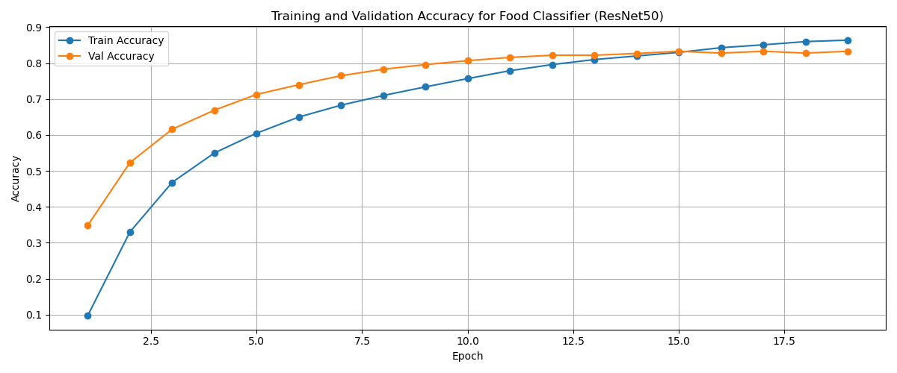
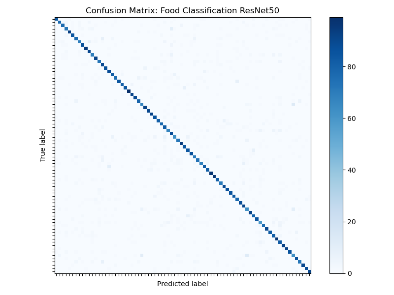

# Food Classification Trainer Documentation

### 1. Overview

This is an overview of the `food_classifier` training pipeline, detailing the architecture, training loop, hyperparameter choices, and evaluation results.

---

### 2. Trainer Pipeline

The training script follows a modular structure:

1. **Device Setup**: Automatically selects MPS (macOS), CUDA (NVIDIA GPU), or CPU.
2. **Data Preparation**: Uses `torchvision.datasets.ImageFolder` with augmentations for training and standard transforms for validation/test.
3. **Model Definition**: Loads a pre-trained ResNet-50, replaces its final fully connected layer, and applies selective layer freezing.
4. **Optimizer & Scheduler**: Utilizes `AdamW` with differential learning rates and a `OneCycleLR` scheduler.
5. **Training Loop**: Implements early stopping based on validation accuracy.
6. **Evaluation**: Computes final test accuracy and generates a confusion matrix.

---

### 3. Design Choices

#### 3.1 Pre-trained Backbone (ResNet-50)

```python
model = models.resnet50(weights=ResNet50_Weights.IMAGENET1K_V2)
in_features = model.fc.in_features
model.fc = nn.Sequential(
    nn.Dropout(0.5),
    nn.Linear(in_features, 78)
)
```

> **Why ResNet-50:** It provides a good balance of depth and computational efficiency, leveraging residual connections to mitigate vanishing gradients. The pre-trained weights on ImageNet help the model generalize better on food images.

#### 3.2 Layer Freezing & Gradual Unfreezing

```python
# Freeze all except layer3, layer4, and fc
for name, param in model.named_parameters():
    param.requires_grad = name.startswith(('layer3', 'layer4', 'fc'))

# After 10 epochs, unfreeze layer1 and layer2
if epoch == 10:
    for name, p in model.named_parameters():
        if name.startswith(('layer1', 'layer2')):
            p.requires_grad = True
```

> **Reasoning:**: Freezing earlier layers prevents overfitting and reduces computation in early stages; unfreezing later allows fine-tuning deeper features once the head has stabilized.

#### 3.3 Data Augmentation

```python
train_transform = transforms.Compose([
    transforms.RandomRotation(30),
    transforms.RandomHorizontalFlip(),
    transforms.RandomResizedCrop(224, scale=(0.8, 1.0)),
    transforms.ColorJitter(0.2, 0.2, 0.2, 0.1),
    transforms.AutoAugment(transforms.AutoAugmentPolicy.IMAGENET),
    transforms.ToTensor(),
    transforms.Normalize(mean=[0.485, 0.456, 0.406],
                         std=[0.229, 0.224, 0.225]),
])
```

> **Use:**: Strong augmentation helps the model generalize across varying viewpoints, scales, and lighting conditions commonly found in food photography.

---

### 4. Training Results

#### 4.1 Accuracy Curves



**Analysis:**

-   The training accuracy steadily increases, reaching over 86% by epoch 20.
-   Validation accuracy peaks at around 82.5% before plateauing, indicating good generalization and early stopping kicking in around epoch 15.

#### 4.2 Confusion Matrix



**Analysis:**

-   Most classes lie along the diagonal, showing high per-class accuracy.
-   A few off-diagonal squares indicate confusion between a few classes. Probably foods with similar visual features.
-   This insight can guide targeted augmentation or class rebalancing.

---

### 5. Conclusion

The entire model has a very solid foundation with a pre-trained ResNet-50 backbone, effective data augmentation, and a well-structured training loop. The results show promising accuracy and generalization capabilities, making it suitable for real-world food classification tasks.
