# Food or Not-Food Filter

## Why do we need this filter?

During our scraping of images from various restaurant websites, we discovered that many of the images are **not food-related**.
This is problematic because:

1. They are **irrelevant** for our actual classification task (e.g. predicting cuisine type).
2. They **waste storage space** (e.g. restaurants with no food images can be ignored entirely).

By filtering out non-food images early in the pipeline, we improve both **accuracy** and **efficiency**.

## Which data do we use?
### Base Dataset

To train our filter, we need a dataset with labeled images of **food** and **not-food**.

Luckily, we can use the [Food or Not dataset](https://www.kaggle.com/datasets/sciencelabwork/food-or-not-dataset),
which contains a total of **50,000 images**:

* 20,000 training images labeled as *food*
* 20,000 training images labeled as *not food*
* 5,000 test images labeled as *food*
* 5,000 test images labeled as *not food*

### Insight of the Dataset

Later, we found out the dataset is already augmented with various transformations:

<table>
  <tr>
    <td>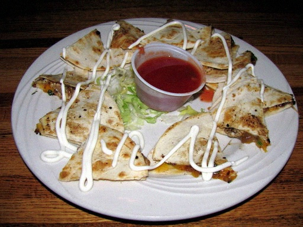</td>
    <td>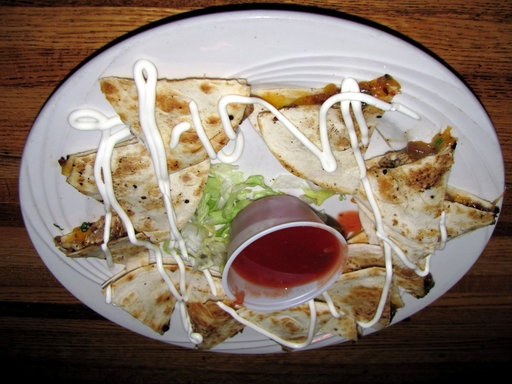</td>
    <td>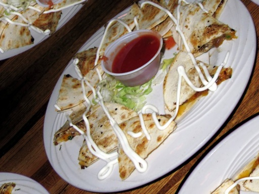</td>
  </tr>
  <tr>
    <td>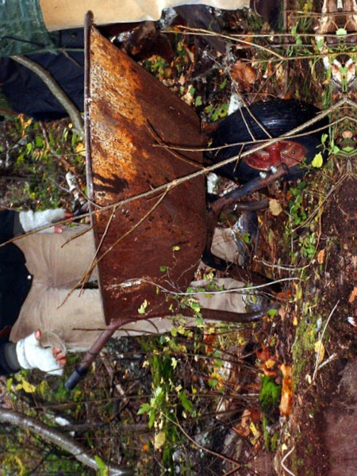</td>
    <td>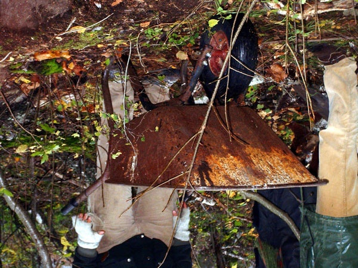</td>
    <td>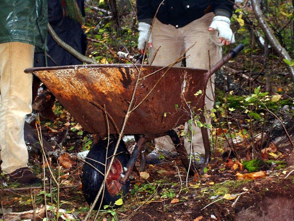</td>
  </tr>
  <tr>
    <td>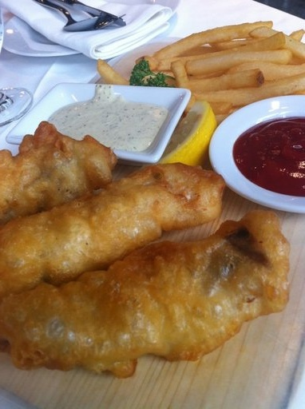</td>
    <td>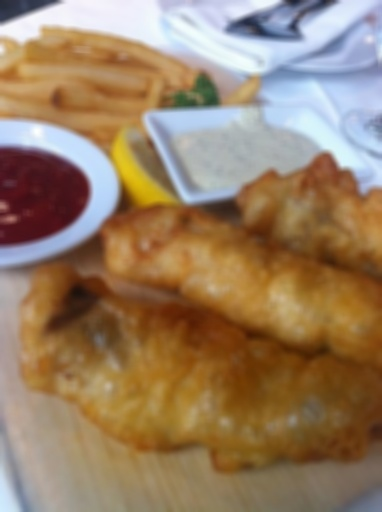</td>
    <td>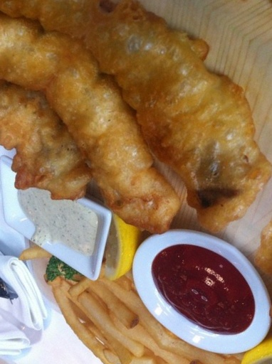</td>
  </tr>
</table>

In general, this would be considered a good thing, because usually during training we augment the dataset in process.

However we decided to concat the dataset with more data from scraped restaurant images so it can classify
food or not food images more accurately for it's specific use case (images on restaurant websites).

That's why we decided to remove all the augmentation from the dataset and use only the original images.
Which left us with the following images:

* 2,000 training images labeled as *food*
* 2,000 training images labeled as *not food*
* 500 test images labeled as *food*
* 500 test images labeled as *not food*

### Improved Dataset

To improve the dataset, we tried to add 50,000 additional images from our scraped restaurant websites.

But the data isn't cleaned yet, so it contains a lot of duplicates, similar (nearly identical) uniform and blurry images,
because of that we used different techniques to filter out the bad images.

* **Duplicate Removal**: We generate sha256 hashes of the images and remove every duplicate hash / image.
* **Similarity Removal**: For that we had to different approaches:
    * **Hamming Distance**: We calculated the perceptual hash of the images,
      these typ of hashes is designed to be similar for visually similar images. We then calculated the Hamming
      distance between the hashes and removed images under a certain threshold. (e.g. < 5)
    * **Cosine Similarity**: We used a pre-trained model to extract feature vectors from the images and then calculated
      the cosine similarity between the vectors. We removed images with a cosine similarity
      above a certain threshold. (e.g. > 0.97)
* **Blurry Image Removal**: We used a Laplacian variance method to delete blurry images over a certain threshold. (e.g. > 100)
* **Uniform Image Removal**: We calculated the standard deviation of the pixel values in the image and removed
  images under a certain threshold. (e.g. < 0.01)

That way we could remove a lot of the bad images, resulting to a total of 20,739 images.

#### Labeling the Images

Now the restaurant images are cleaned, now we want to label them as *food* or *not food*. Labeling 20,000 images
is pretty time-consuming, so we decided to train a CNN model based of the base dataset and label the images automatically.
In a secondary step we then manually filter all the badly labeled images.

The training of the model we will describe in the section: [Training of the CNN Model](#training-of-the-cnn-model).

#### Final Dataset

After concatenating the base dataset with the restaurant images and labeling them, we end up with a total of **26,000 images**:
Which then we split into training (80%), validation (10%) and test (10%) sets:

<table>
  <tr>
    <th>Set</th>
    <th>Food</th>
    <th>Not Food</th>
    <th>Total</th>
  </tr>
  <tr>
    <td>Training</td>
    <td>6,704</td>
    <td>14,365</td>
    <td>21,069</td>
  </tr>
  <tr>
    <td>Validation</td>
    <td>838</td>
    <td>1,796</td>
    <td>2,634</td>
  </tr>
  <tr>
    <td>Test</td>
    <td>838</td>
    <td>1,796</td>
    <td>2,634</td>
  </tr>
  <tr style="font-weight: bold;">
    <td>Total</td>
    <td>8,380</td>
    <td>17,957</td>
    <td>26,337</td>
  </tr>
</table>

The dataset can be viewed in the following directory: [dataset](../modelling/food_or_not_food/dataset).

## Training of the CNN Model

To train our CNN model, we use the PyTorch framework.
Our model for the food or not-food classifier is based on the pretrained **ResNet** models from the `torchvision` library.
We trained multiple models with different datasets (e.g. base dataset / improved dataset), additional augmentation and different splits.
In the following we will give a quick overview of all the trained models and their performance.

### Training Overview

The following list shows the models in the correct order:

* **ResNet18 on the base dataset without augmentation:** The first trained, which was also used for
  the labeling of the restaurant images.
* **ResNet18 on the base dataset with augmentation:** The second trained model, which was to see if already augmented
  data (from the base dataset) will improve, after we trained it with an additional 10x augmentation.
* **ResNet18 on the improved dataset with augmentation:** The third trained model.
* **ResNet50 on the improved dataset with augmentation:** The fourth trained model,
  to see if a larger can improve the performance of the model.

Although we start with a pre-trained model (`resnet18(weights=ResNet18_Weights.DEFAULT)`) or (`resnet50(weights=ResNet50_Weights.DEFAULT`), some adjustments are
necessary to tailor it to our binary classification task:

### Required Customizations

1. **Final Layer Replacement**
   The original ResNet18 and ResNet50 is trained for 1,000 ImageNet classes.
   Which means we need to modify the final layer to output only **2 classes**: *food* and *not food*.
   For the ResNet18 we replace the final layer with a fully connected linear layer with 2 output features:
   ```pycon
   model.fc = nn.Linear(model.fc.in_features, 2)
   ```
   For the ResNet50, we define a sequential layer with an additional dropout layer for regularization:
   ```pycon
   model.fc = nn.Sequential(
       nn.Dropout(0.5),
       nn.Linear(model.fc.in_features, 2)
   )
   ```

2. **Loss Function**
   Since this is a classification task, we use `CrossEntropyLoss`, which is standard for multi-class problems
   (including binary classification with logits).

3. **Optimizer**
   We use the **Adam optimizer** with a learning rate of 0.001 to efficiently update weights during training.

4. **Early Stopping**
   To prevent overfitting, we implement a simple early stopping mechanism.
   If the validation loss does not improve for 5 consecutive epochs, training stops.
   Because the base dataset only got a train and test split, during training we used the test partition also as validation.
   Which is not ideal, but we decided it's good enough. For the improved dataset we got a test and validation split.

5. **Data Augmentation**
   For the augmentation we defined a `torchvision` transformer pipeline to then multiply our loaded dataset by 10.
   The transformer looks like this:
   ```pycon
   train_transform = transforms.Compose([
        transforms.RandomResizedCrop(224),
        transforms.RandomHorizontalFlip(),
        transforms.RandomRotation(15),
        transforms.ColorJitter(brightness=0.2, contrast=0.2, saturation=0.2, hue=0.1),
        transforms.RandomAffine(degrees=0, translate=(0.1, 0.1)),
        transforms.RandomVerticalFlip(p=0.1),
        transforms.RandomGrayscale(p=0.1),
        transforms.ToTensor(),
        transforms.Normalize(mean=default_mean, std=default_std),
    ])
   ```
   Which does the following:
    * Randomly resizes and crops the image to 224x224 pixels.
    * Randomly flips the image horizontally.
    * Randomly rotates the image by up to 15 degrees.
    * Randomly adjusts the brightness, contrast, saturation, and hue of the image.
    * Randomly translates the image by up to 10% in both x and y directions.
    * Randomly flips the image vertically with a probability of 10%.
    * Randomly converts the image to grayscale with a probability of 10%.

   With this transformer, we can now augment our dataset:
   ```pycon
   augmentations_per_image = 10

   augmented_datasets = [
      datasets.ImageFolder(str(train_dir), transform=train_transform)
      for _ in range(augmentations_per_image)
   ]
   train_data = ConcatDataset(augmented_datasets)
   ```

---

### Model Performance during Training

The following plots shows us the performance progress during the training.
For the ResNet18 model we used the loss instead of the accuracy to visualize the performance.

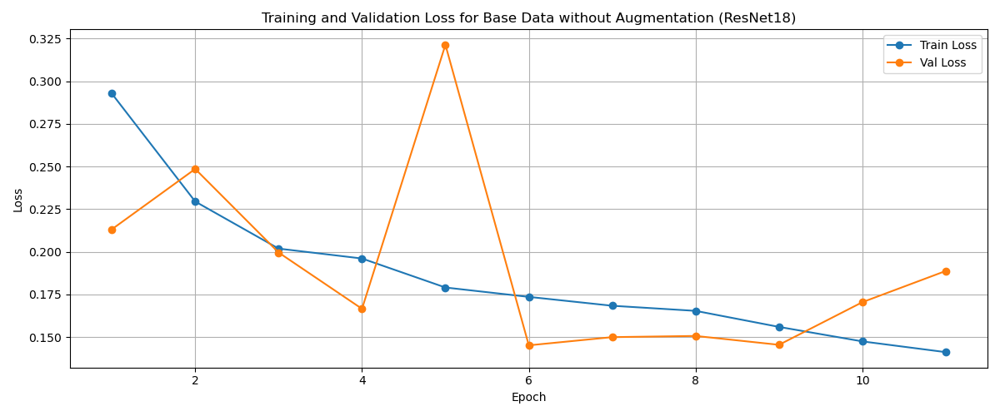
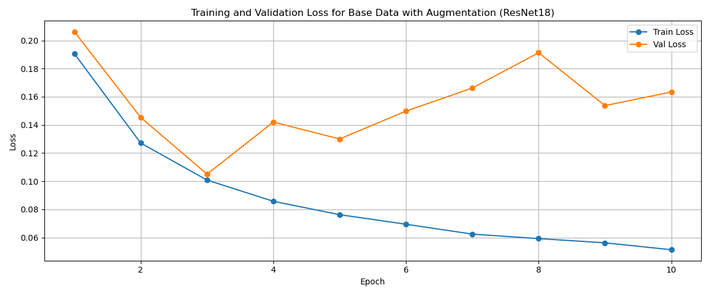
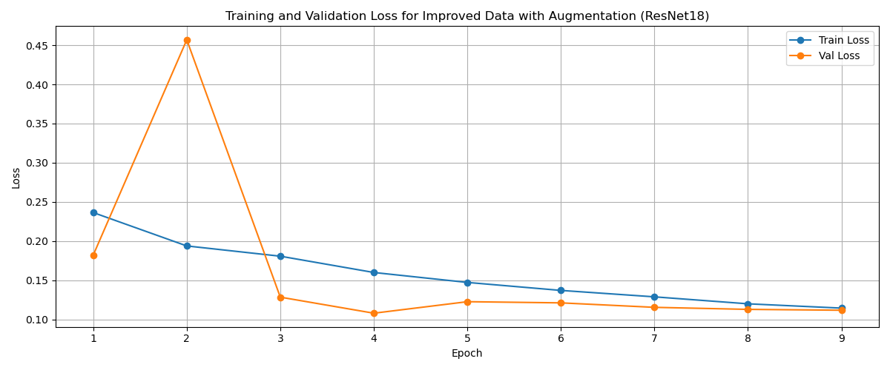
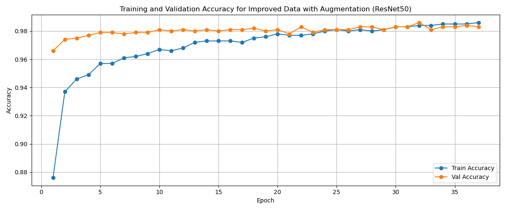

What we can see the training of the ResNet18 always ends after 10 epoches.
The reason could be, for training the ResNet50 model we additionally used a `OneCycleLR` scheduler to adjust the learning rate during training.

```pycon
scheduler = OneCycleLR(
    optimizer,
    max_lr=1e-4,  # max learning rate for the head
    total_steps=num_epochs * len(train_loader),
    pct_start=0.3,
    div_factor=25,
    final_div_factor=1e4,
)
```
Then during the training we can call the scheduler step:
```pycon
scheduler.step()
```
This shows us using a scheduler can improve the training alot and let us do more epoches.
To then better understand if the model is overfitting or not.

### Model Performance on Testing Data

The following plots show us the performance on the test split of the improved dataset of all the trained models.

First we see the accuracy:
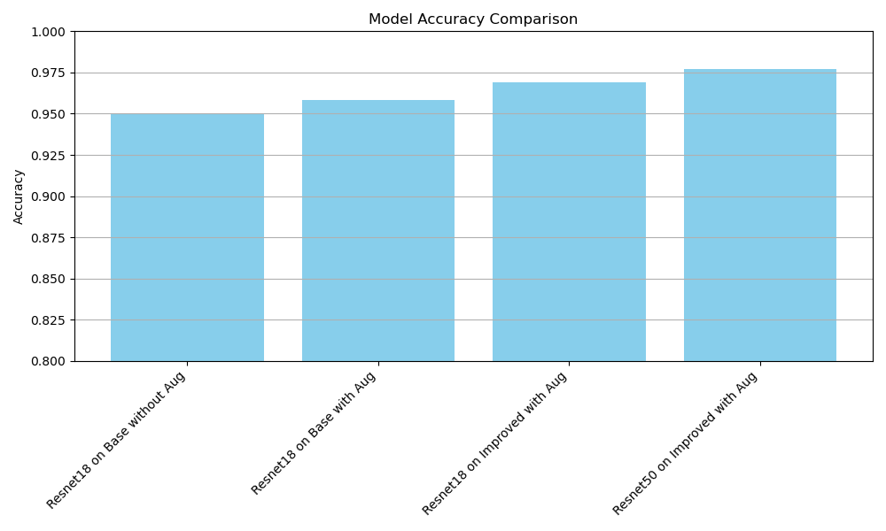

Second we see the precision, recall and F1 score in comparison:
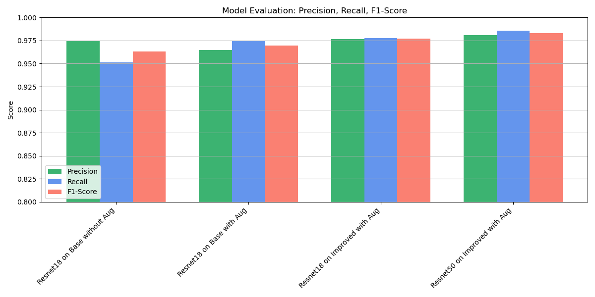

### Confusion Matrix

To better understand the performance of our models, we can visualize the confusion matrix.

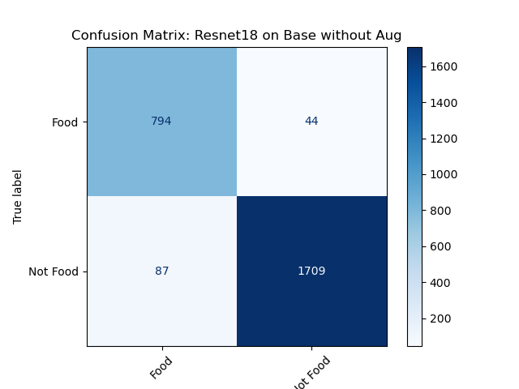


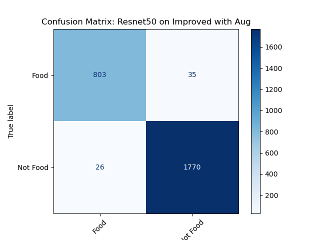
