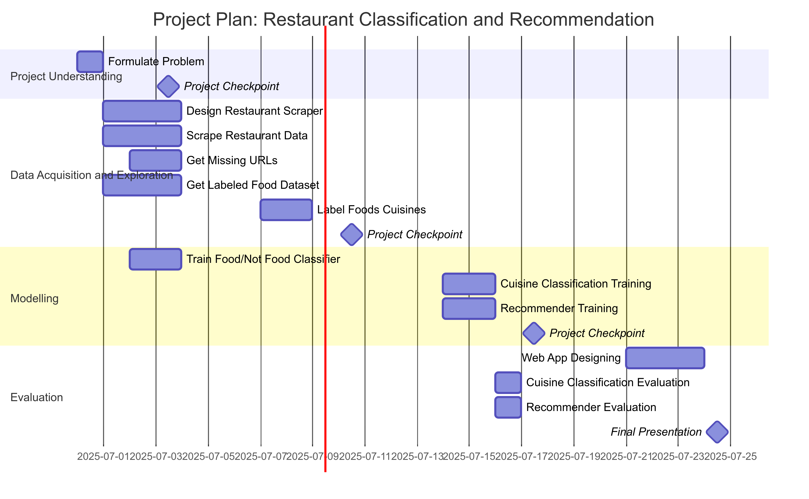

# Project Charta
## Problem Definition

The purpose of this project is to design a web app with two functions: Classifying food into cuisine types based on images, and recommending restaraunts in Switzerland based on user preferences. OpenStreetMap does not have a cuisine type defined for many of its restaraunts, leaving a gap in their data. By classifying these images, we will be able to suggest a cuisine type for OpenStreetMap restaraunts that currently do not have a cuisine type assigned to them, or otherwise suggest fixes if they are innacurate. The restaraunt recommender can help users to find new restaraunts that are in line with their tastes and preferences. 

## User Segments & Needs

We identify two primary user groups:

* Curious diners and tourists: People who want to discover new places to eat but struggle with vague or inconsistent tags in mapping apps.

    * Need: Easy discovery of restaurants that match their taste preferences, possibly based on photos of food.

* Mapping and data improvement communities: Volunteers or professionals contributing to OSM.

    * Need: A scalable way to improve cuisine type information for under-described restaurants.

Users want an intuitive tool that helps them explore, discover, and trust the information about restaurants — ideally through a visual and preference-based interface.

## Stakeholders

| Stakeholder         | Role / Goal                                                              |
| ------------------- | ------------------------------------------------------------------------ |
| Project team        | Build and test the web app; develop the image classification model       |
| End users           | Use the app to discover restaurants and get accurate cuisine suggestions |
| OpenStreetMap users | Benefit from enriched and corrected restaurant metadata                  |
| Restaurant owners   | May benefit indirectly from improved visibility and recommendations      |
| University faculty  | Oversee the academic and technical direction of the project              |

## Situation Assessment
The human resources available to us are four developers with a varying level of experience in the subject matter. We will all be utilizing VSCode and GitHub to manage our codebase, and we all have a fair amount of experience using these tools. We will only have four weeks to complete this task, so we will have to use our time wisely to complete this on time.

We may eventually run into problems with the restaurants we parse if they do not contain useful food images. The quality and variety of photos on these sites may throw off our model, and we should take steps to make sure 

## Project Goals and Success Criteria
This project will be successful when we are able to classify and predict cuisine types based on a series of images with at least 70% accuracy.

We will also have to utilize a web app that recommends restaraunts based on user reviews. As the effectiveness of these recommendations is largely subjective, we will consider this successful if we have a web app that is capable of recommending restaraunts to the developers that we agree are reasonable with the information we provide.

## Data Mining Goals

We will be utilizing multiple models to accomplish our tasks. We will need the following models:

### 1. Food/Not Food Classifier

**Type of Task**: Binary Classification  
**Goal**: Automatically detect whether an image scraped from a restaurant website depicts food or not.

**Dataset**:

* The *Food vs Not Food* dataset (publicly available)
* Supplemented with manually validated scraped images from restaurant websites

**Metric**:

* *F1-score ≥ 0.90*, to ensure strong balance between precision and recall

**Purpose**:  
Filter out irrelevant or non-food images, improving the accuracy and cleanliness of data passed into downstream models.

---

### 2. Cuisine Predictor

**Type of Task**: Multi-class Classification  
**Goal**: Predict the cuisine type (e.g., Italian, Chinese, Swiss) of a restaurant based on a collection of its food images.

**Dataset**:

* Labeled cuisine image datasets (e.g., Food2k)
* Validated food images scraped from restaurant websites, optionally labeled by matching known cuisine types

**Metric**:

* *Top-1 Accuracy ≥ 0.75*
* *Top-3 Accuracy ≥ 0.90* (to allow for multiple plausible cuisine matches)

**Purpose**:  
Assign cuisine labels to OpenStreetMap restaurants that lack this metadata, enhancing search and filtering within the application.

---

### 3. Restaurant Recommender System

**Type of Task**: Hybrid Recommender System (Collaborative + Content-Based)  
**Goal**: Recommend a short list of relevant restaurants to users based on reviews or declared preferences.

**Dataset**:

* TripAdvisor restaurant reviews (includes restaurant metadata and user-generated review text)
* Simulated or real user input preferences for evaluation

**Metric**:

* *Precision@5 ≥ 0.80* (4 of 5 suggestions should be considered relevant)
* *MAP (Mean Average Precision)* may also be calculated to assess ranking performance

**Approach**:

* Compare similarity with restaurant reviews to generate personalized suggestions

**Purpose**:  
Enable personalized restaurant discovery based on user intent and experience narratives, beyond just metadata filtering.

## Project Plan
There are four primary phases to this project that will mostly be done in the order in which they are presented, but may have some overlap:

* **Project Understanding**: Discussion and planning of the project and its objectives.
* **Data Acquisition and Exploration**: Finding data sources and working through the process of obtaining and cleaning that data.
* **Modelling**: Designing and training models.
* **Evaluation**: Evaluating models and designing of final web app.

{#fig-project-plan}

## Roles and Contact Details

### Adam Opperman
* **Role**: *Data Acquisition/Structurer*
* **Tasks**:  
  * Collect image datasets for use of cuisine classification.
  * Clean and label image cuisine types.
* **Contact**:  
  * Email: oppermaa@mail.gvsu.edu 
  * GitHub: [oppermaa](https://github.com/oppermaa)

---

### Moritz Feuchter
* **Role**: *Developer, Project Structure Lead*
* **Tasks**:  
  * Designed and developed the cuisine classification pipeline  
  * Constructed the layout and environment of the project
  * Develop process for getting missing site URLs for *OpenStreetMap*
* **Contact**:  
  * Email: feuchmor@students.zhaw.ch  
  * GitHub: [x-tr4ce](https://github.com/x-tr4ce)

---

### Nino Frei
* **Role**: *Developer, Data Structurer*
* **Tasks**:  
  * Scrape *OpenStreetMap* data for restaurants/cafes in Switzerland.
  * Clean and sort image data.
  * Train Food/Not Food model.
* **Contact**:  
  * Email: freinin1@students.zhaw.ch 
  * GitHub: [shinarove](https://github.com/shinarove)

---

### Sawyer Rogers
* **Role**: *Developer, Documenter*
* **Tasks**:  
  * Design and implement the restaurant scraping spider.  
  * Manag CSV-based status tracking and image processing.  
  * Support integration with downstream classification systems.  
  * Document project charta.E
* **Contact**:  
  * Email: rogersaw@mail.gvsu.edu  
  * GitHub: [rogersaw711](https://github.com/rogersaw711)
