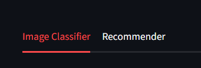

## Overview

**ForkCast** is a Streamlit web application that combines two core functionalities:

1. **Image Classification**: Users can upload food-related images or submit a webpage URL to scrape food images. These are then cleaned and prepared for classification by a food cuisine classifier.
2. **Restaurant Recommendation**: Based on collaborative filtering, users receive personalized restaurant suggestions using a recommender system trained on historical review data.

---

## 1. Project Structure

The application is written in Python and powered by the following libraries:

* `streamlit`: Web UI and user interactivity
* `Pillow (PIL)`: Image manipulation
* `requests` + `BeautifulSoup`: Web scraping
* `surprise`: Recommendation engine using matrix factorization (SVD)
* `pandas`: Data loading and transformation

The main script contains both app logic and backend functions, with two tabs in the UI:

* **Cuisine Classifier**
* **Recommender**

## 2. Cuisine Classifier

### Uploading or Scraping Images

Users can:

* Upload multiple images (jpg, jpeg, png)
* Submit a URL, and the system will scrape `` tags, filter and preprocess them

Following uploading:

* All images are converted into jpegs and resized to a constant size to allow for predictability and consistency in classification.
* Calls the classifier while passing a file location where all images are located

If a user has less than two reviews, they will not receive any recommendations. After at least two reviews have been submitted by a given user, they will receieve a restaurant recommendation based on their reviews, which is accomplished via Surprise's SVD function:

```python
    reader = Reader(rating_scale=(1, 5))
    data = Dataset.load_from_df(df[["user", "item", "rating"]], reader)
    trainset = data.build_full_trainset()

    # Train SVD model
    model = SVD()
    model.fit(trainset)
```

For further information, see [classifier documentation](cuisine_classifier.qmd)

## 3. Recommender System

Data is stored in a csv with the following format:\
restaurantName|reviewerId|rating|reviewDate,\

Each line represents a single review. A user may review several restaurants, and a restaurant may be reviewed by many users.

Users interact with it by:

* Entering their user ID
* Selecting a restaurant from a dropdown
* Providing a star rating (1 to 5)
* Submitting the review
* Receiving a recommendation if eligible

See [recommender documentation](recommender.qmd) for an in-depth description of the recommender.

## 4. Streamlit App Design

App is divided into two primary tabs, one for image classification and one for restaurant recommendation. This is accomplished very easily via:

```python
    classifierTab, recommenderTab = st.tabs(["Image Classifier", "Recommender"])
```



The recommender is embedded directly into the Streamlit app and is not saved. Since the model needs to be retrained after every new review, very little is gained by saving the model. 

## 5. Future Development

There are multiple ways in which we could improve the app in the future:

* Let users tag or label images to improve training data
* Store reviews in a permenant database instead of CSV
* Add login/authentication system instead of allowing people to upload reviews under any UserID

## 6. Running App

App can be currently be run locally via streamlit run webapp.py. Making this publically accessible may be an option for the future,
but we will allow it to just exist locally for proof of concept.

## 7. File Layout
Base/\
├── webapp.py\
├── combined_reviews.csv\
├── images/\
├── ForkCast.png\
└── favicon.png\